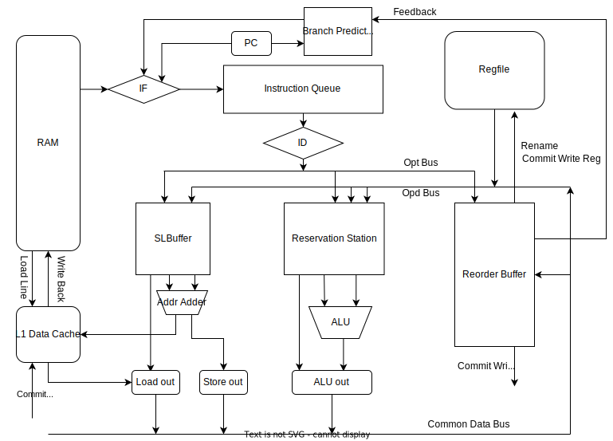

# RISCV-Simulator-2022

A dynamic scheduling RISCV ISA simulator, implemented in C++.  

This implementation derives from an extended **Tomasulo’s algorithm** that supports hard-ware based speculation.

## Architecture

Supports ([a part of](https://github.com/Yang-Chincheng/RISCV-Simulator-2022/tree/pipeline)) the RV32I ISA.

As shown below in the diagram, the simulator consists of a **RS** (Reservation Station), a **RoB** (Reorder Buffer), a **SLB** (Store and Load Buffer), a **ALU** (Arithmetic Logic Unit), several buses and other functional or store units.

There are 5 stages in the lifetime of an instruction:

1. **fetch**, read the instruction and makes branch prediction(, if needed)

2. **issue**, decodes the instruction and sends it to corresponding functional units

3. **execute**, execute the instruction

4. **write result**, write the execution result into CDB and accesses the memory

5. **commit**, actually commits the result of the execution 

The simulator is implemented with a mixture of combinational and sequential logic, which ensures that such 5 stages can be executed out of order in each cycle.

## Branch prediction

For speculation, three mechanisms derived from **two-level adaptive branch prediction** are used:

+ a 3-bit **GAs predictor**, or a two-level adaptive predictor with one 3-bit <u>global</u> history register and per-set pattern history tables

+ a 2-bit **SAs predictor**, or a two-level adaptive predictor with 2-bit <u>local</u> history tables and per-set pattern history tables

+ a **tournament predictor** that combines GAs and SAs predictor, and adaptively <u>selects</u> one of their prediction results

| testcase       | prediction number | global accuracy | local accuracy | tournament accuracy |
| -------------- | ----------------- | --------------- | -------------- | ------------------- |
| array_test1    | 22                | 0.5455          | 0.5455         | 0.5455              |
| array_test2    | 26                | 0.5000          | 0.5000         | 0.5000              |
| basicopt1      | 155139            | 0.7867          | **0.8623**     | 0.8619              |
| bulgarian      | 71493             | 0.6433          | 0.9444         | **0.9445**          |
| expr           | 111               | 0.5676          | **0.7658**     | **0.7658**          |
| gcd            | 120               | **0.6417**      | 0.6333         | 0.6333              |
| hanoi          | 17457             | 0.8440          | **0.8667**     | 0.8649              |
| lvalue2        | 6                 | 0.6667          | **0.8357**     | 0.6667              |
| magic          | 67869             | 0.6586          | 0.5987         | **0.8293**          |
| manyarguments  | 10                | 0.8000          | 0.8000         | 0.8000              |
| multiarray     | 162               | 0.6358          | **0.6605**     | **0.6605**          |
| qsort          | 200045            | 0.8539          | 0.9178         | **0.9209**          |
| queens         | 77116             | 0.6510          | **0.7374**     | 0.7363              |
| statement_test | 202               | **0.6584**      | 0.6535         | 0.6485              |
| superloop      | 435027            | 0.8716          | **0.9519**     | **0.9519**          |
| tak            | 60639             | **0.8055**      | 0.7741         | 0.8017              |

## Cache

A 32KB direct mapping cache with 64B cache lines. 

Only L1 data cache is implemented to accelerate load and store operations.

| testcase       | cycles without cache | cycles with cache | Improvement |
| -------------- | -------------------- | ----------------- | ----------- |
| array_test1    | 475                  | 450               | **+5.26%**  |
| array_test2    | 561                  | 527               | **+6.06%**  |
| basicopt1      | 1455311              | 1458813           | -0.24%      |
| bulgarian      | 787388               | 716114            | **+9.05%**  |
| expr           | 1402                 | 1395              | **+0.50%**  |
| gcd            | 1301                 | 1278              | **+1.77%**  |
| hanoi          | 430564               | 379244            | **+11.91%** |
| lvalue2        | 124                  | 127               | -2.42%      |
| magic          | 1278926              | 1177982           | **+7.89%**  |
| manyarguments  | 139                  | 142               | -2.16%      |
| multiarray     | 4225                 | 3772              | **+10.72%** |
| naive          | 60                   | 61                | -1.67%      |
| qsort          | 2864518              | 2720666           | **+5.02%**  |
| queens         | 1354472              | 1268086           | **+6.38%**  |
| statement_test | 2630                 | 2604              | **+0.99%**  |
| superloop      | 1391009              | 1391013           | -0.00%      |
| tak            | 4275976              | 3396289           | **+20.57%** |

## About

PPCA 2022 assignment
